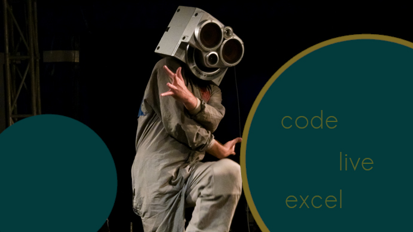

## 👋 Short introduction 👋

✨ A dedicated individual with experience in many different fields and a passion for
coding. ✨

currently studying at 42 coding school in Florence. Leveraging a background in performing
arts and education, seeking to transition into a software development role where his creativity,
adaptability and problem-solving skill could be utilized to contribute to new and exciting innovative
projects.

  

 
 

  

 
 

  ## My projects

 

- 🔭 I’m currently working on a basic raytracer in C
- 🌱 I’m currently learning c, c++, javascript, arudino
- 📫 How to reach me: [ LinkedIn](https://www.linkedin.com/in/tjaž-juvan-234b862b9)
&nbsp;
- 😄 Pronouns: he/him
- ⚡ Fun fact: my opposable thumbs oppose even the hardest bugs!
